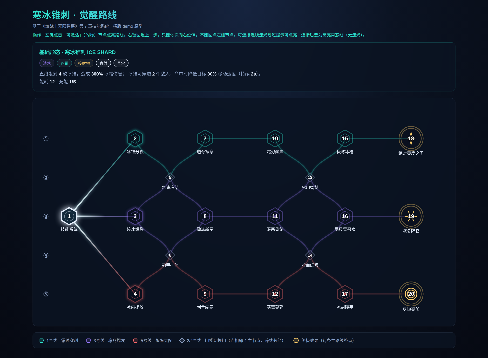
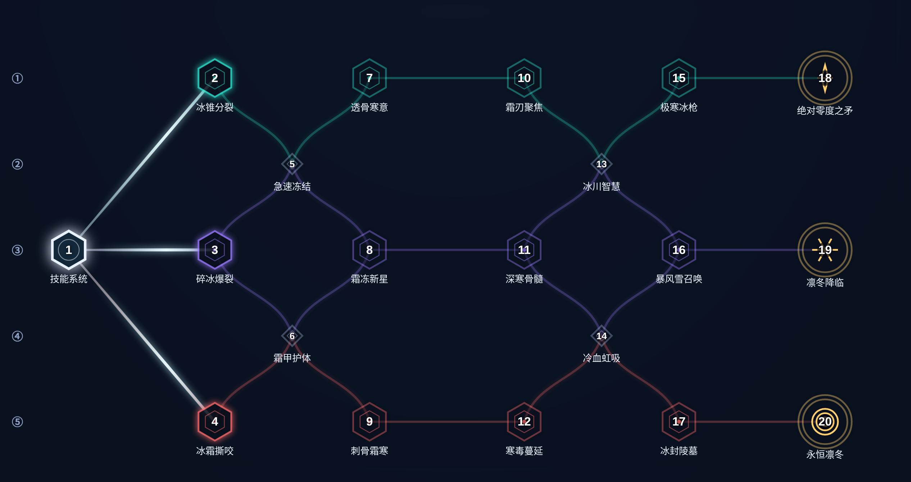
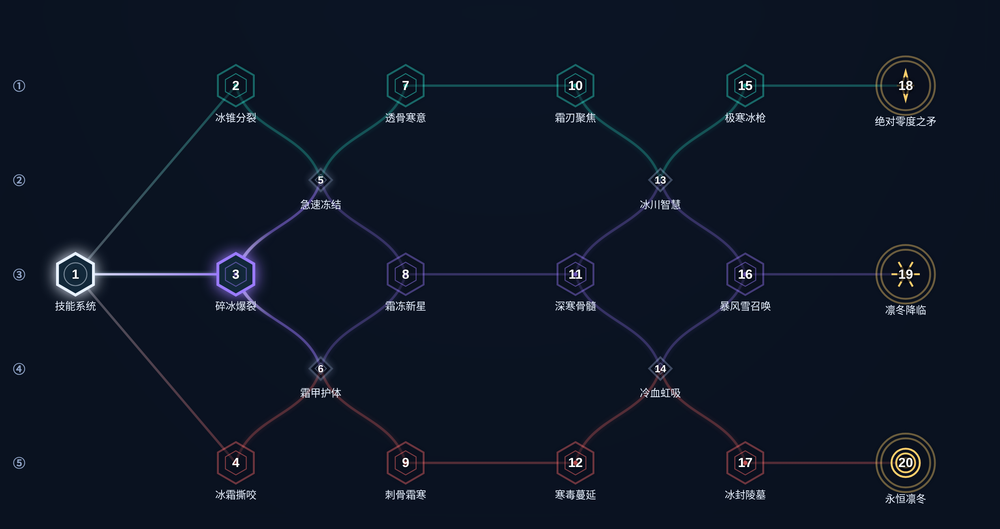
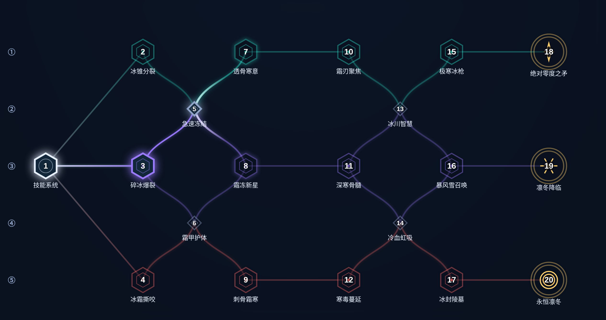
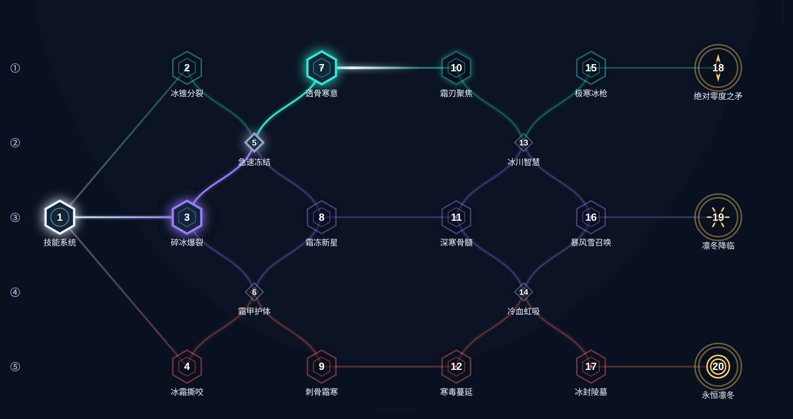
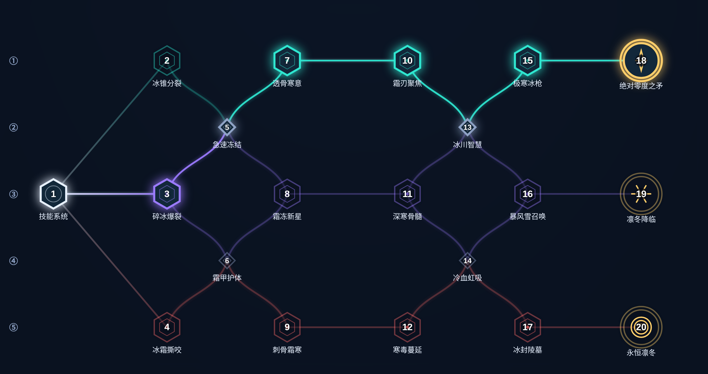
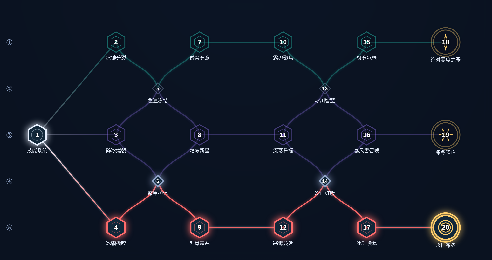

# 技能专精（觉醒树）· 开发文档

> 《爆战丨无限弹幕》技能系统 · 觉醒路线交互原型
> 状态：**基础搭建完成**（拓扑 / 交互 / 视觉规则已定，数值待填充）
> 归档计划：后续完善后归档到主文档《爆战丨无限弹幕》技能系统章节（第 7 章）
> 真相源：本仓库 `docs/` 目录（本文档只描述实现，不复制代码）

---

## 1. 文件清单

| 文件 | 作用 |
|---|---|
| `docs/skill-tree-ice-shard.html` | 觉醒树交互原型（自包含单文件，双击即开），首个技能：寒冰锥刺 ICE SHARD |
| `docs/skill-tree-ice-shard.json` | 同一套拓扑的结构化数据（routes / connections / numbering），供后续接数值系统 |
| `docs/screenshots/*.png` | 各关键状态截图（本文档引用） |
| `docs/skill-awakening-ice-shard.md` | 本文档 |

> 该原型与主 demo（`index-h.html` + `js/*`）**互不冲突**：独立页面、独立数据，
> 不参与 `build_single.cjs` 打包，不需要跑构建。

---

## 2. 整体效果

画布 1060×560（viewBox），三条主进化路线（1/3/5 号线）+ 两条门槛切换门（2/4 号线，菱形），
起点在左，终极效果（圆形）在右。节点全局编号 **1~20**（左→右、每列内上→下，起点=1）。

---

## 3. 状态截图（点亮序列）

### 3.1 初始：起点三选一

起点(1)连向 2 / 3 / 4，三条连线全部流光划过，三节点闪烁待点亮。

### 3.2 点亮 3 → 兄弟分支关闭

点 3(碎冰爆裂) 后：1→2、1→4 取消流光并变淡（分支取舍）；
3→5(门A)、3→6(门C) 开始流光（二选一）。

### 3.3 点亮 5(门A) → 门C 关闭

点 5 后：6(门C) 失流光、3→6 变淡；2→5（已关闭侧的进线）同样无流光变淡；
只剩 5→7、5→8 流光。门槛连线已按主路线上色：3→5 / 5→8 偏紫（3号线）、5→7 偏绿（1号线）。

### 3.4 点亮 7 → 同阶二选一

点 7 后：8 被禁止（5→8 取消流光并变淡）；7→10 开始流光。
反向同理：先点 8 则 7 被禁止。

### 3.5 完整路线示例

- 走通 1 号线：1 → 3 → 5(门A) → 7 → 10 → 13(门B) → 15 → 18(绝对零度之矛)

- 走通 5 号线：1 → 4 → 6(门C) → 9 → 12 → 14(门D) → 17 → 20(永恒凛冬)

---

## 4. 拓扑与编号（20 节点）

| 编号 | id | 名称 | 类型 | 位置 |
|---|---|---|---|---|
| 1 | origin | 技能系统 | 起点 | x=80, y=290 |
| 2 | l1t1 | 冰锥分裂 | 六边形·1号线 t1 | x=250, y=90 |
| 3 | l3t1 | 碎冰爆裂 | 六边形·3号线 t1 | x=250, y=290 |
| 4 | l5t1 | 冰霜撕咬 | 六边形·5号线 t1 | x=250, y=490 |
| 5 | l2b1 | 急速冻结 | 菱形·门A | x=340, y=190 |
| 6 | l4b1 | 霜甲护体 | 菱形·门C | x=340, y=390 |
| 7 | l1t2 | 透骨寒意 | 六边形·1号线 t2 | x=430, y=90 |
| 8 | l3t2 | 霜冻新星 | 六边形·3号线 t2 | x=430, y=290 |
| 9 | l5t2 | 刺骨霜寒 | 六边形·5号线 t2 | x=430, y=490 |
| 10 | l1t3 | 霜刃聚焦 | 六边形·1号线 t3 | x=610, y=90 |
| 11 | l3t3 | 深寒骨髓 | 六边形·3号线 t3 | x=610, y=290 |
| 12 | l5t3 | 寒毒蔓延 | 六边形·5号线 t3 | x=610, y=490 |
| 13 | l2b2 | 冰川智慧 | 菱形·门B | x=700, y=190 |
| 14 | l4b2 | 冷血虹吸 | 菱形·门D | x=700, y=390 |
| 15 | l1t4 | 极寒冰枪 | 六边形·1号线 t4 | x=790, y=90 |
| 16 | l3t4 | 暴风雪召唤 | 六边形·3号线 t4 | x=790, y=290 |
| 17 | l5t4 | 冰封陵墓 | 六边形·5号线 t4 | x=790, y=490 |
| 18 | l1f | 绝对零度之矛 | 圆形·终极（穿刺之刃图案） | x=960, y=90 |
| 19 | l3f | 凛冬降临 | 圆形·终极（霜爆星芒图案） | x=960, y=290 |
| 20 | l5f | 永恒凛冬 | 圆形·终极（同心冰环图案） | x=960, y=490 |

**连线 28 条**：起点→第一列 ×3；每条主线 5 段（t1→门→t2→t3→门→t4→终极）×3；
门A 额外连 l1t1/l3t2，门C 额外连 l3t1/l3t2…（详见 `skill-tree-ice-shard.html` 内 `skillData.links`，
与 JSON 完全一致）。

---

## 5. 交互与视觉规则（已定稿）

### 5.1 操作

| 操作 | 行为 |
|---|---|
| 左键点击 | 激活「可点亮」节点（闪烁中） |
| 右键（画布任意处） | 回退上一步（栈式，起点不可回退） |
| 悬浮 | 显示 tooltip（编号 / 类型 / 路线 / 效果 / 状态） |

### 5.2 三种连线状态

| 状态 | 视觉 |
|---|---|
| `locked` 未解锁 / 已被取舍 | 半透明淡线（opacity .3），**无流光** |
| `activatable` 待点亮 | 常态线上叠加**流光划过**（柔和渐变光带，1.8s 线性循环） |
| `active` 已连接 | 高亮常态线 + 微外发光，**无流光** |

### 5.3 分支取舍（互斥规则，核心）

> 规则：候选 X 连着已激活节点 Y，且 Y 还连着一个**已激活、与 X 同 x 的兄弟 Z** → X 被关闭
> （禁止点亮、失流光、连线变淡）。对所有分叉一视同仁。

- 点 3 → 2、4 关闭（起点三选一）
- 点 5(门A) → 6(门C) 关闭；点 6 → 5 关闭（同阶门二选一）
- 点 5 后再点 7 → 8 关闭；**反推**点 8 → 7 关闭（门后同阶二选一）
- 点 13(门B) 后点 15 → 16 关闭，以此类推
- 只能向右延伸：不能点亮 x 小于当前最右激活节点的节点（maxX 规则）

### 5.4 门槛门连线配色

门槛门连线取「非门那一端」所属主路线颜色（`gateMainColor()`），不再是统一灰蓝：

| 连线 | 颜色 |
|---|---|
| 2→5、5→7、10→13、13→15（接 1 号线） | 偏绿 `#2fe6d0` |
| 3→5、3→6、5→8、6→8、11→13、13→16、11→14、14→16（接 3 号线） | 偏紫 `#9b7bff` |
| 4→6、6→9、12→14、14→17（接 5 号线） | 偏红 `#ff6b6b` |

门连线加粗（2.6px）+ 主色外发光；流光核心色 = 主路线色提亮 72%（`mixWhite`），保留色相。
其余连线流光为白亮色 `#eafcff`。

### 5.5 其它视觉约定

- 六边形角朝上，内嵌小一圈图形 + 中心点；实心不透明（遮挡下层连线）
- 连线绘制在节点**下方**（先画线后画节点）
- 直线连接（`straight: true`）：1→2、1→4、7→10、8→11、9→12、15→18、16→19、17→20；其余柔和贝塞尔
- 三个终极圆内图案不同：穿刺之刃 / 霜爆星芒 / 同心冰环

---

## 6. 技术实现要点

- **纯原生实现**：单文件 HTML + 内联 SVG + 原生 JS（`createElementNS`），无依赖
- **状态机**：`activated[]`（已激活集合）+ `history[]`（回退栈）
- **核心函数**：
  - `computeActivatable()` → `{ act, actb, dimmed }`：可达集（maxX 右延规则）→ 分支取舍（dimmed）→ 可点亮集
  - `linkState(link, res)` → `'active' | 'activatable' | 'locked'`：双端激活=active；
    单端激活且另一端在 actb=activatable；否则 locked（被取舍的线自动变淡）
  - `render()`：全量重绘。先连线后节点；仅 `activatable` 连线追加流光 path
- **流光**：`linearGradient`（透明→亮→透明）+ `animateTransform translate` 沿连线线性平移，
  与路径长度无关，软边缘无锯齿
- **已知坑（勿回退）**：SVG filter 用百分比 region 时，水平线 bbox 高度为 0 → 滤镜区域塌缩 → 线被裁剪消失。
  因此连线**不用** `feGaussianBlur` filter，辉光一律用 CSS `drop-shadow` 实现

---

## 7. 待完善（后续迭代）

- [ ] 数值填充：每个节点的精确数值（与主文档 7.4 对齐，替换 JSON 占位）
- [ ] 右键回退级联化：撤销某节点时同时撤销其下游分支（现为栈式单步）
- [ ] 其余技能的觉醒树复用（换 `skillData` 即可，拓扑/规则/渲染通用）
- [ ] 与主 demo 集成：从 `js/skill-panel.js` 的技能弹窗入口打开觉醒树
- [ ] 归档主文档：规则与拓扑定稿后写入《爆战丨无限弹幕》技能系统章节

---

## 8. 变更记录

| 日期 | 内容 |
|---|---|
| 2026-09-04 | 基础搭建完成：5 路线 20 节点拓扑、互斥取舍、流光/高亮状态、门槛连线上色、本文档与截图入库 |
